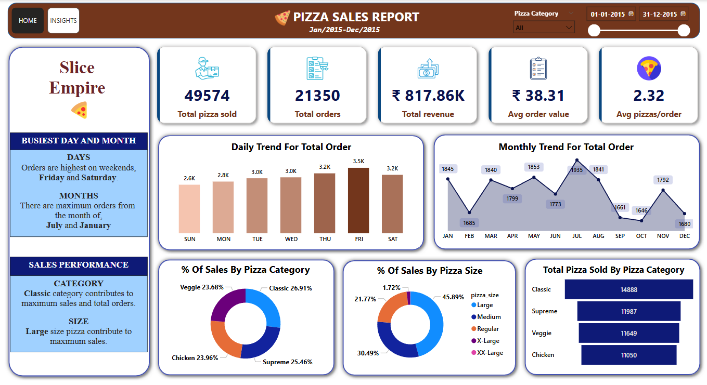

# Pizza Sales Dashboard

This project is a **Pizza Sales Dashboard** built using **Power BI**, **SQL**, **Excel**, and **Power Query**. The dashboard provides insights into pizza sales trends, key performance indicators (KPIs), and customer behavior over a timeline.

## Features
- **SQL Database Connection**: Power BI is connected to an SQL database to retrieve sales data.
- **Data Import & Transformation**: Data is imported via SQL and transformed using Power Query.
- **Data Modeling**: Relationships between tables (Sales, Customers, Products) are established.
- **Calculated Columns & Measures**: KPIs and custom calculations are implemented using **DAX**.
- **Interactive Visualizations**: Sales trends, revenue breakdown, and customer insights are displayed in Power BI.

---

##  Tech Stack
- **Power BI** - Data visualization and dashboard creation  
- **SQL** - Storing and retrieving structured sales data  
- **Power Query** - Data transformation and cleaning  
- **Excel** - Supporting data preprocessing  
- **DAX (Data Analysis Expressions)** - Custom metrics and calculations  

---

## Data Model
The dashboard uses three main tables:  
1. **Sales** - Contains order details (Order ID, Date, Product ID, Customer ID, Quantity, Price, Total Amount).  
2. **Products** - Lists available pizzas with their categories.  
3. **Customers** - Stores customer details and their region.  

### Relationships:
- `Sales[ProductID]` → `Products[ProductID]`
- `Sales[CustomerID]` → `Customers[CustomerID]`

---

## Dashboard Insights
- **Total Sales Revenue** 
- **Average Order Value** 
- **Total Orders** 
- **Monthly Sales Growth** 
- **Sales Breakdown by Category & Region** 

---

## Steps to Run the Project
### 1 Connect SQL Database to Power BI
- Open **Power BI Desktop**.
- Go to **Home → Get Data → SQL Server**.
- Enter **Server Name** and **Database Name** (`PizzaSalesDB`).
- Load the `Sales`, `Products`, and `Customers` tables.

### 2 Data Transformation (Power Query)
- Merge tables to get a unified dataset.
- Remove duplicates and clean missing data.
- Convert data types appropriately.

### 3 Data Modeling (Relationships)
- Establish relationships between `Sales`, `Products`, and `Customers`.

### 4 Create DAX Measures
- Add calculated fields such as **Total Sales, Average Order Value, and Monthly Growth**.

### 5 Build Dashboard
- Drag and drop **KPIs, Line Charts, Bar Graphs, and Tables**.
- Use **slicers** to filter data by time, category, or region.

---
## Dashboard Screenshots  

---

## Key Learnings
- How to connect Power BI to an **SQL Database**.
- Transforming and modeling data efficiently.
- Writing **DAX measures** for custom insights.
- Creating **interactive dashboards** with KPIs and trends.

---

## Future Improvements
 Implement **Forecasting Models** using Power BI AI visuals.  
 Automate data updates using **Power BI Service**.  

---
